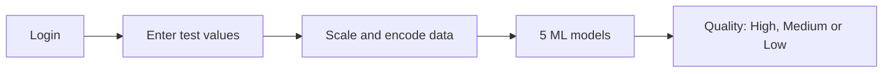

<div align="center">

<!--  -->


# Hi 👋, I'm G Devika


<br>

<a href="https://linkedin.com/in/g-devika-36488130a"></a>
<a href="mailto:devikagorebalc@gmail.com"></a>
<a href="https://your-portfolio-link"></a>
</div>

---

## 👩‍💻 About me

```python
class Devika:
    role = "Python Full Stack Developer"
    education = "B.E. in Computer Science Engineering, 2026"
    location = "Bengaluru, India"
    skills = ["Python", "Django", "JavaScript", "SQL", "OOP"]
    loves = ["Data Structures and Algorithms", "Machine Learning", "Building things that work"]

    def looking_for(self):
        return "My first Full Stack Developer role. Let's talk!"
```


I finished a full stack internship and a **Python Full Stack Developer** program at Destination Career. I like building web apps from start to end: the database, the Python backend, and the page the user sees.

---

## 🚀 What I've built

<details>
<summary><b>🎙️ Nova AI Voice Assistant</b> &nbsp;|&nbsp; Python, OOP, Speech Recognition (Feb to May 2026)</summary>
<br>

- Listens to voice commands and **replies with speech**.
- Used **OOP** to keep responses, web tasks and the GUI in separate parts.
- Built a simple, friendly interface so anyone can use it.
- Helps with everyday tasks by giving useful actions and information.

</details>

<details>
<summary><b>🌿 Cinnamon Quality Classification</b> &nbsp;|&nbsp; Python, Django, HTML, CSS (Internship project)</summary>
<br>

A full stack web app that predicts cinnamon quality (**High, Medium or Low**) from chemical test values like moisture, ash, volatile oil and coumarin.




- Trained and compared **5 models**: Logistic Regression, Decision Tree, Random Forest, SVM and KNN. The best one is highlighted by accuracy.
- Secure **login and registration** with Django authentication.
- Cleaned and prepared the data with **NumPy and Pandas**.

</details>

📌 More projects are in my [repositories](https://github.com/devikagorebal?tab=repositories).

---

## 🛠️ Tech stack

<div align="center">


</div>

**Also:** Oracle SQL, REST APIs, Object-Oriented Programming

---

## 🌱 Right now

| | |
|---|---|
| 🔭 **Building** | My portfolio website with animations |
| 📚 **Practising** | Data Structures and Algorithms, SQL |
| 🤖 **Exploring** | Machine Learning with Python |
| 🎯 **Looking for** | An entry-level Full Stack Developer role |

---


## 📊 GitHub stats

<div align="center">


</div>

---

<div align="center">

### 💬 Let's connect

I reply fast. Send me a message about a role, a project or a collab.


</div>
